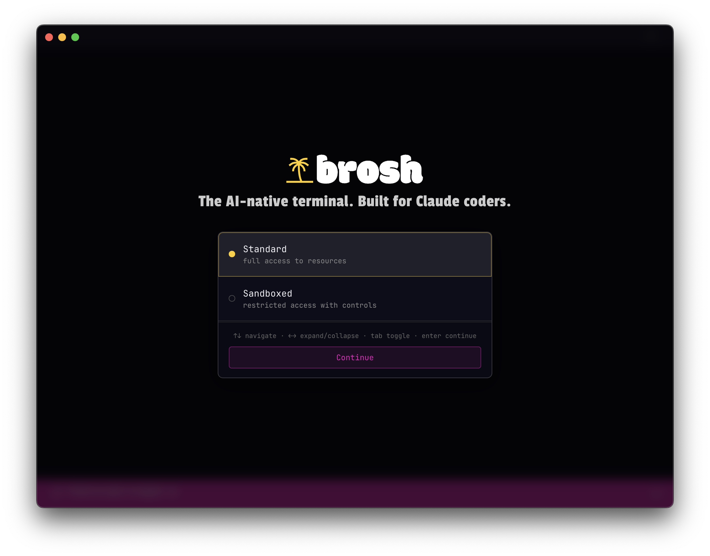
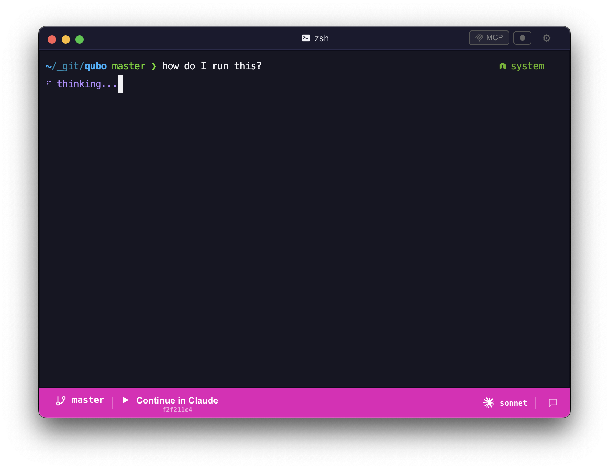
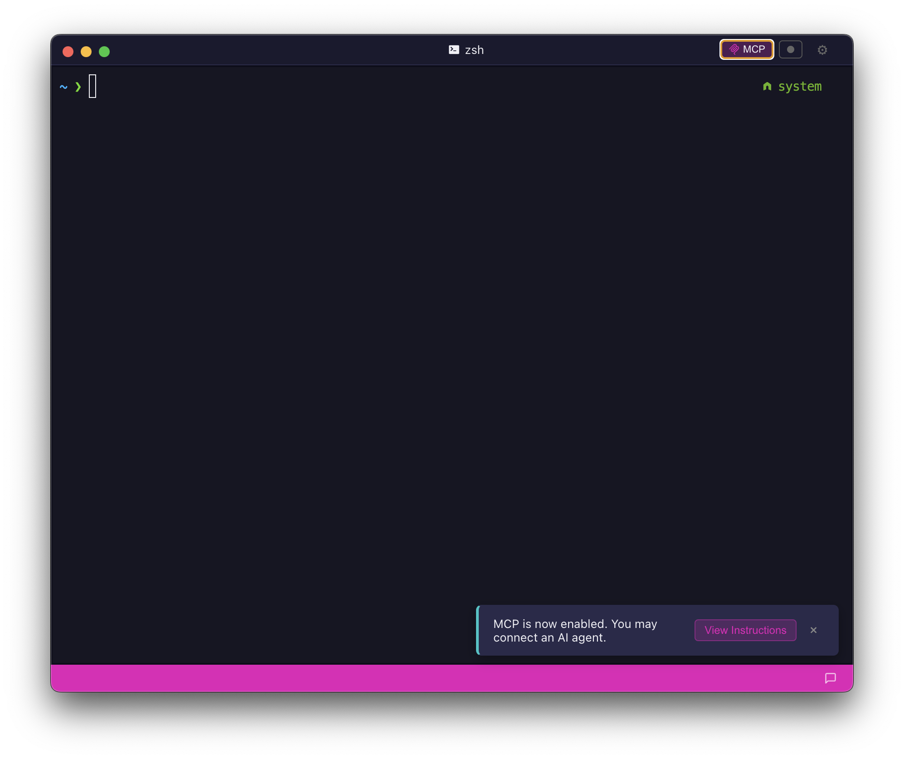
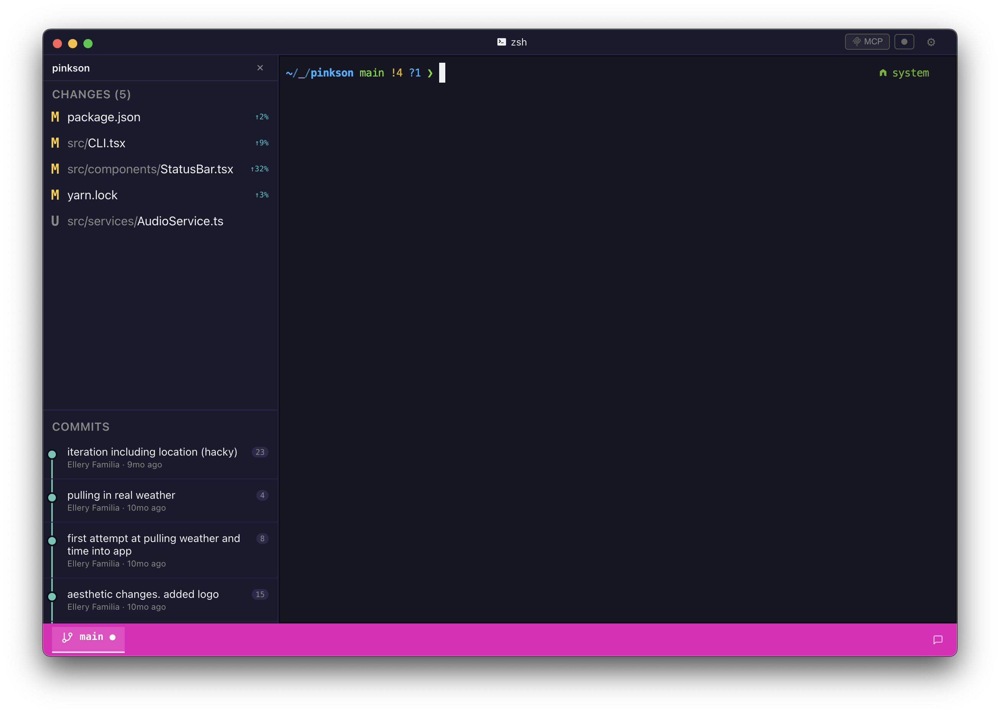
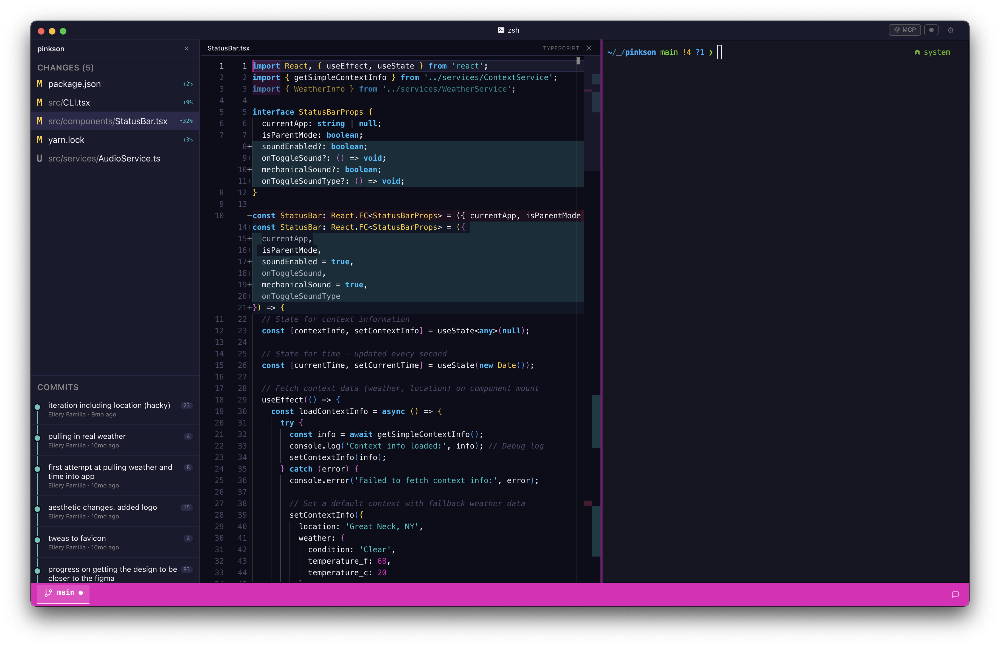
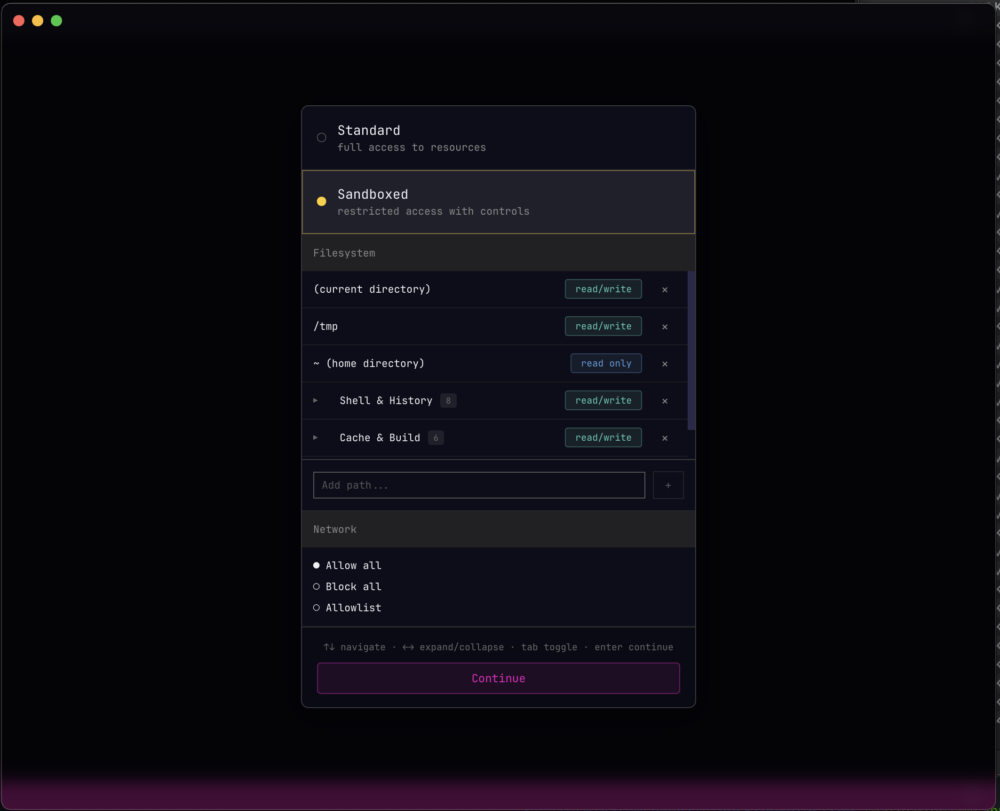

<p align="center">
  <strong>The AI-native terminal. Built for Claude coders.</strong>
</p>

<p align="center">
  <a href="https://github.com/elleryfamilia/brosh/releases"></a>
  <a href="LICENSE"></a>
  
</p>



## Install

**Homebrew (macOS):**

```bash
brew install --cask elleryfamilia/brosh/brosh
```

**Direct download:** `.dmg` (macOS) / `.AppImage` (Linux) from the [releases page](https://github.com/elleryfamilia/brosh/releases).

**Build from source:**

```bash
git clone https://github.com/elleryfamilia/brosh.git
cd brosh/packages/desktop-electron && npm install && npm run start
```

**CLI only:** `npm install -g brosh` or `brew install elleryfamilia/brosh/brosh-cli` -- [more install options](./docs/installation.md)

## Features

- [**Claude Code integration**](#claude-code-integration) -- Natural language detection, model switching, "Continue in Claude" handoff, built-in MCP server
- [**Split panes & tabs**](#terminal) -- Horizontal/vertical splits with draggable dividers, multi-tab interface
- [**Git sidebar**](#git-integration) -- Visual commit graph, file change tracking, Monaco diff editor
- [**Sandbox mode**](#sandbox-mode) -- Restrict filesystem and network access per session
- [**Themes & customization**](#terminal) -- 9 themes, 25+ fonts, cursor styles, window opacity, scrollback
- [**MCP tools**](#mcp-integration) -- Give Claude Code direct access to type, read, and screenshot your terminal
- [**Session recording**](#developer-tools) -- Record to asciicast format, play back with asciinema
- **Cross-platform** -- macOS, Linux

---

## Claude Code Integration

brosh is purpose-built for working with Claude Code. Every part of the terminal is designed to make AI-assisted development seamless.

- **Natural language detection** -- An ML classifier distinguishes commands from questions in real time. Type `git push` and it runs. Type `how do I rebase onto main?` and Claude answers.
- **Model switching** -- Switch between Sonnet, Opus, and Haiku from the status bar.
- **MCP server built in** -- Claude Code connects over MCP and can see your terminal, run commands, and read output. No extra setup.
- **Continue in Claude** -- Start a conversation in the terminal and seamlessly continue it in the Claude Code CLI with full context.
- **Smart status bar** -- Git branch, active Claude model, MCP connection status, and session info at a glance.





## Terminal

- Multi-tab interface with split panes (horizontal and vertical)
- Draggable panel dividers for custom layouts
- 9 built-in themes and 25+ fonts
- Cursor style options, window opacity, and configurable scrollback
- Find bar for searching terminal output

## Git Integration

Built-in git sidebar with visual commit graph, file change tracking, and a Monaco-powered diff editor.



Click any changed file to open a full diff view:



## Sandbox Mode

Choose between standard and sandboxed terminal sessions at launch. Sandbox mode restricts filesystem and network access so Claude can only touch what you allow.



See [docs/sandbox.md](./docs/sandbox.md) for configuration details.

## Developer Tools

- Monaco code editor integration
- Terminal session recording ([asciicast format](./docs/recording.md))
- Cross-platform: macOS, Linux

## MCP Integration

The desktop app runs a built-in MCP server on a Unix socket, giving Claude Code direct access to your terminal session.

Add to your Claude Code MCP settings:

```json
{
  "mcpServers": {
    "terminal": {
      "command": "brosh"
    }
  }
}
```

| Tool | Description |
|------|-------------|
| `type` | Send text input to the terminal |
| `sendKey` | Send special keys and key combinations |
| `getContent` | Retrieve terminal buffer content |
| `takeScreenshot` | Capture terminal state with metadata |
| `startRecording` | Start recording terminal output |
| `stopRecording` | Stop recording and save file |

See [docs/tools.md](./docs/tools.md) for the full API reference.

## Keyboard Shortcuts

| Shortcut | Action |
|----------|--------|
| <kbd>Cmd</kbd>+<kbd>T</kbd> | New tab |
| <kbd>Cmd</kbd>+<kbd>N</kbd> | New window |
| <kbd>Cmd</kbd>+<kbd>W</kbd> | Close tab |
| <kbd>Cmd</kbd>+<kbd>D</kbd> | Split pane vertically |
| <kbd>Cmd</kbd>+<kbd>Shift</kbd>+<kbd>D</kbd> | Split pane horizontally |
| <kbd>Cmd</kbd>+<kbd>Shift</kbd>+<kbd>G</kbd> | Toggle git sidebar |
| <kbd>Cmd</kbd>+<kbd>F</kbd> | Find in terminal |
| <kbd>Cmd</kbd>+<kbd>,</kbd> | Settings |

## CLI Mode

brosh also works as a standalone CLI terminal and MCP server without the desktop app:

```bash
brosh              # Interactive mode -- shell + MCP server on Unix socket
brosh --sandbox    # With filesystem/network restrictions
brosh --record     # With session recording
```

See the [docs/](./docs/) folder for CLI flags, recording, and sandbox configuration.

## Development

```bash
# Core library
npm install && npm run build

# Desktop app
cd packages/desktop-electron
npm run dev          # Dev mode with hot-reload
npm run package      # Build distributable
```

### Linux: Sandbox binaries

The desktop app bundles statically-compiled `socat` and `bwrap` (bubblewrap) so sandbox mode works out of the box on any Linux distro. The binaries are built automatically during `npm run package` (via `prepackage`). You just need the build tools installed:

```bash
# One-time setup (Linux only)
sudo apt-get install -y meson ninja-build pkg-config libcap-dev
```

The script fetches the latest source releases from upstream, compiles static binaries, and places them in `resources/bin/`. On macOS the step is a no-op. You can also run it manually with `npm run prepare-sandbox-bins`.

## Documentation

- [Overview](./docs/index.md) -- [Installation](./docs/installation.md) -- [Architecture](./docs/architecture.md)
- [Tools Reference](./docs/tools.md) -- [Configuration](./docs/configuration.md) -- [Examples](./docs/examples.md)
- [Recording](./docs/recording.md) -- [Sandbox Mode](./docs/sandbox.md)

## Requirements

- **Desktop App**: macOS 10.15+, Linux
- **CLI**: Node.js 18+

## License

MIT

The Linux desktop build bundles [socat](http://www.dest-unreach.org/socat/) (GPL-2.0) and [bubblewrap](https://github.com/containers/bubblewrap) (LGPL-2.1) as standalone executables for sandbox support. See [`packages/desktop-electron/THIRD-PARTY-NOTICES`](packages/desktop-electron/THIRD-PARTY-NOTICES) for full license texts.
